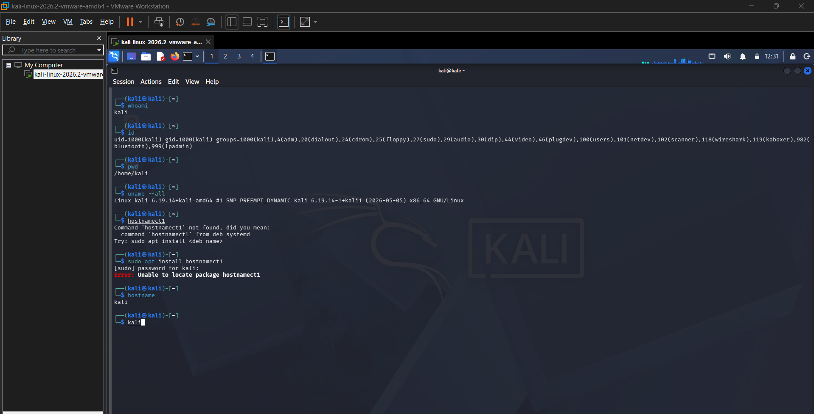

# Assignment 02 — Exploring the Kali Linux Environment

After getting Kali installed in the last assignment, this one was about actually poking around inside it — the desktop, the menus, the terminal — and getting comfortable with where things are.

## What I was trying to do

Basically just explore the Kali desktop environment (the GUI side), see how the Application Menu and System Settings are laid out, and then jump into the terminal and run a few commands to pull up user and system info.

## The desktop itself

Kali by default runs on **Xfce**, which is a lightweight desktop environment — nothing fancy, but it's responsive and doesn't eat up resources, which makes sense for a security distro people often run inside a VM (like I am). From here you can launch apps, manage windows, and get to all the system utilities.

## Application Menu

This is basically Kali's version of a Start Menu — everything's grouped into categories like Accessories, Development, Internet, Multimedia, System, and so on. Makes it a lot easier to find a tool without knowing its exact command-line name.

## System Settings

Same idea as any OS settings panel — display, keyboard, mouse, network, appearance, power, all in one place. Nothing Kali-specific here, just standard desktop config.

## Terminal work

This is where it got more interesting. I opened a terminal and ran through a few commands to check the current user, group memberships, working directory, and system/kernel info:

```
whoami
id
pwd
uname -a
hostnamectl
```



Here's what actually happened, command by command:

- **`whoami`** → `kali`, as expected.
- **`id`** → gave the full breakdown: `uid=1000(kali) gid=1000(kali)`, plus a long list of groups the `kali` user belongs to — `adm`, `dialout`, `cdrom`, `floppy`, `sudo`, `audio`, `dip`, `video`, `plugdev`, `users`, `netdev`, `scanner`, `wireshark`, `kaboxer`, `bluetooth`, `lpadmin`. That `wireshark` group jumped out at me — makes sense given Kali's whole purpose.
- **`pwd`** → `/home/kali`, confirming I was in the default user's home directory.
- **`uname -a`** → full kernel string: `Linux kali 6.19.14+kali-amd64 #1 SMP PREEMPT_DYNAMIC Kali 6.19.14-1+kali1 (2026-05-05) x86_64 GNU/Linux`. Same kernel build I saw when verifying the install in Assignment 1.
- **`hostnamectl`** → this one didn't actually work first try. The shell said the command wasn't found and suggested `hostnamectl` (note the spelling) from the `systemd` package, so I tried `sudo apt install hostnamectl` — that also failed with "Unable to locate package." In the end I just used plain `hostname`, which returned `kali` without any issue.

So not everything went perfectly clean, but that's kind of the point of actually doing this hands-on instead of just reading about it — you run into small stuff like a missing package or a typo'd command and have to work around it.

## What I took away from this

- Kali's GUI (Xfce) and its command line aren't separate worlds — they're two ways into the same system, and a lot of the more serious tools live only in the terminal.
- `id` gives a lot more than `whoami` — seeing which groups a user belongs to (like `wireshark` or `sudo`) tells you a lot about what that account is actually allowed to do.
- Not every command you'd expect to "just work" does — `hostnamectl` failing was a small reminder that Linux distros don't always ship with every utility pre-installed, and you sometimes have to find the plain fallback (`hostname` in this case).
- Compared to something like Windows, Linux leans a lot more on the terminal and a structured filesystem rather than click-through settings panels — which takes some adjusting to, but gives a lot more direct control once you're used to it.

## Wrapping up

This one was less about installing anything and more about just getting familiar with how Kali is laid out — the desktop, the menus, and especially the terminal. Even the one command that didn't work first try (`hostnamectl`) ended up being a useful little lesson in troubleshooting on Linux instead of just following steps blindly.
