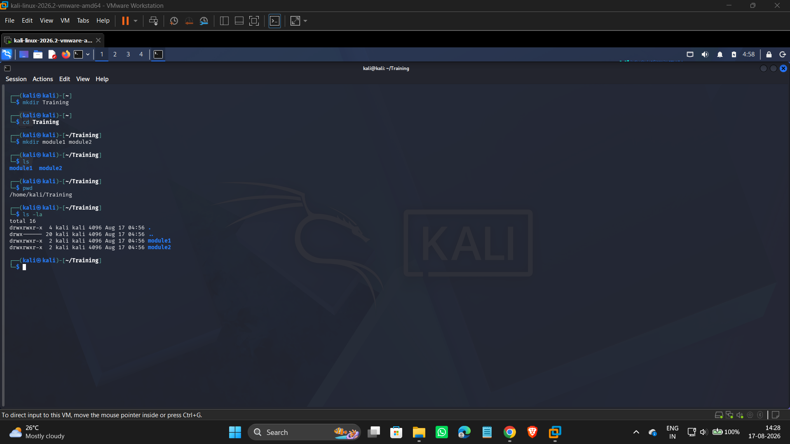

# Assignment 01 — File and Directory Navigation

First proper hands-on with basic Linux commands in Kali — nothing complicated, just the everyday stuff you end up typing constantly: making folders, moving into them, and checking where you are and what's there.

## What I was trying to do

Practice the fundamentals of moving around a Linux filesystem from the terminal — creating directories, navigating into them, confirming the current location, and listing what's inside.

## What I actually ran

```
mkdir Training
cd Training
mkdir module1 module2
ls
pwd
ls -la
```



Step by step, here's what happened:

- **`mkdir Training`** — created a new folder called `Training` in the home directory.
- **`cd Training`** — moved into it. The prompt updates to show `~/Training`, which is a handy way to always know where you are without needing to run `pwd` constantly.
- **`mkdir module1 module2`** — created two subfolders in one line. `mkdir` can take multiple names at once like this, so there's no need to run it twice.
- **`ls`** — quick check right after, just to confirm both folders (`module1`, `module2`) actually got created.
- **`pwd`** — printed the full path: `/home/kali/Training`. Good habit to run this whenever you're not 100% sure where you've ended up.
- **`ls -la`** — the detailed listing. This one shows more than a plain `ls`:
  - `total 16` — total disk blocks used by the contents
  - `.` and `..` — the current directory and its parent (these are what `-a` reveals; a plain `ls` hides them)
  - Full permission strings, owner (`kali`), group (`kali`), size, and last-modified timestamp for each entry
  - Both `module1` and `module2` showing up as directories (`drwxrwxr-x`)

## A small thing worth noting

My original plan was to name the folders `"Module 1"` and `"Module 2"` with a space and capital letters — but looking at the actual terminal output, I went with `module1` and `module2` instead (no space, lowercase). Not a big deal functionally, but it's worth mentioning because folder names *with* spaces need to be quoted in the terminal (like `"Module 1"`) or the shell reads them as two separate arguments — so going with no-space names sidesteps that entirely, which is honestly the easier habit to build early on.

## What I took away from this

- `mkdir` can create several directories in a single command — no need to repeat it.
- The terminal prompt itself (`~/Training`) already tells you your current location most of the time, but `pwd` is the reliable source of truth when you need to be certain.
- `ls` vs `ls -la` — the difference isn't just "more info," it's specifically permissions, ownership, size, timestamps, and the hidden `.`/`..` entries that a plain `ls` doesn't show at all.
- Avoiding spaces in folder/file names from the start avoids a whole category of quoting headaches later on.

## Wrapping up

Simple assignment, but this is exactly the kind of muscle memory that everything else in Linux builds on top of — you can't really do anything more advanced in the terminal if `mkdir`, `cd`, `pwd`, and `ls` aren't already second nature.
